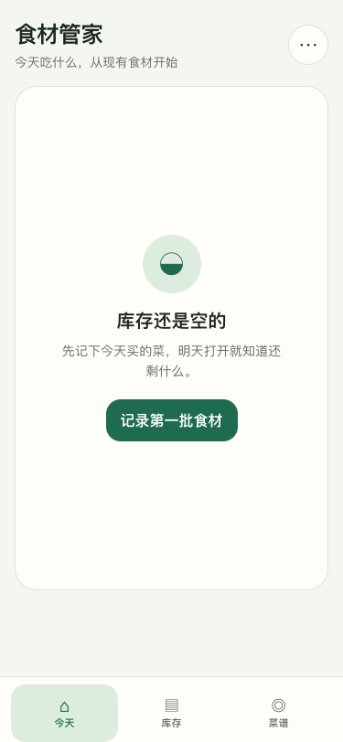
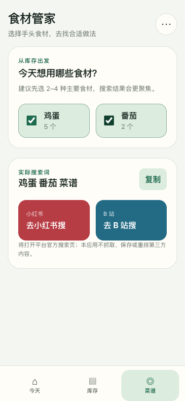
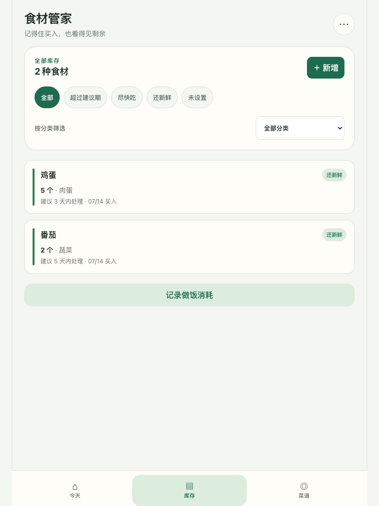
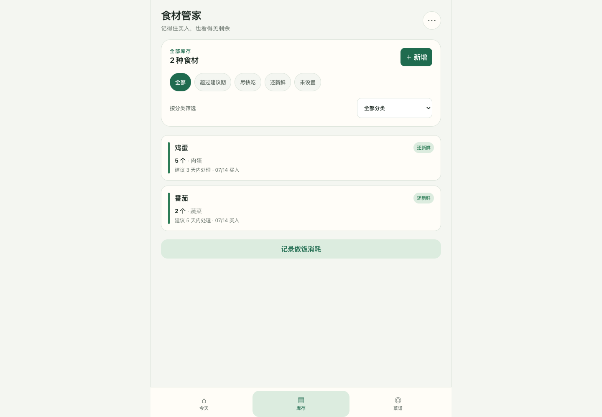

# 食材管家视觉验收

## 验收信息

- 日期：2026-07-14
- 功能 revision：`f02900d`
- 浏览器：Chromium
- 设计方向：移动优先、低干扰、自然绿色状态语义、底部三栏导航

## 截图证据

### 375×812：首次空状态

### 375×812：菜谱搜索

### 768×1024：库存页

### 1440×1000：桌面库存页

## 检查结论

| 维度 | 结果 | 证据 |
|---|---|---|
| 信息层级 | 通过 | 页面标题、主任务卡片、状态标签和主操作层次清晰 |
| 响应式 | 通过 | 三个目标宽度均无横向滚动；桌面主体保持 720px |
| 固定导航 | 通过 | 底栏未遮挡最后一项，内容区保留底部安全间距 |
| 文本与状态 | 通过 | 最长状态文案、日期、数量和平台说明均未裁切 |
| 触控 | 通过 | 按钮与筛选项达到 44px，复选框使用更大的标签点击区 |
| 对比度 | 通过 | 平台色加深、辅助文字透明度提高；键盘焦点轮廓可见 |
| 一致性 | 通过 | 圆角、边框、间距、状态色和按钮语义在三页一致 |

视觉评分：97 / 100。扣分项是桌面端仍刻意保持单列手机布局，没有利用宽屏增加并列信息；这是个人移动优先产品的范围选择，不影响第一版目标。

## 已修正问题

- 小号按钮、筛选 chip 和 Toast 关闭按钮从 36–40px 提升到 44px。
- 小红书与 B 站按钮使用更深背景色，提升白字对比度。
- 升级生产构建后主动清除旧 service worker，避免截图误用旧 CSS 缓存。
